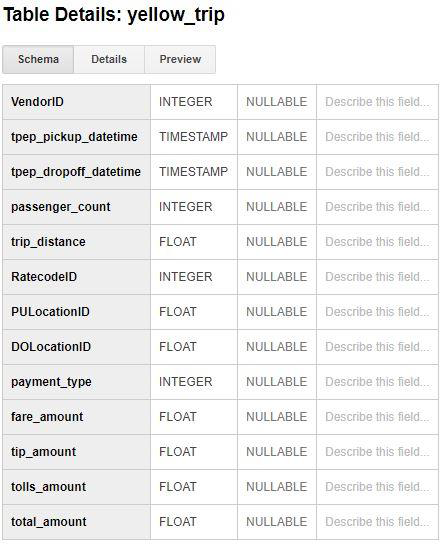
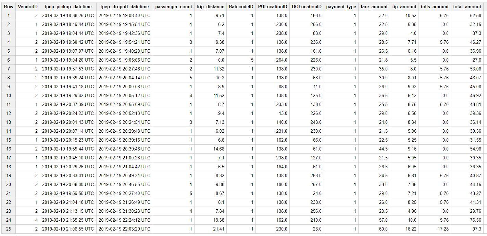
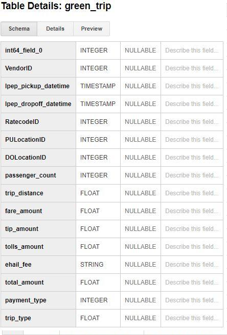
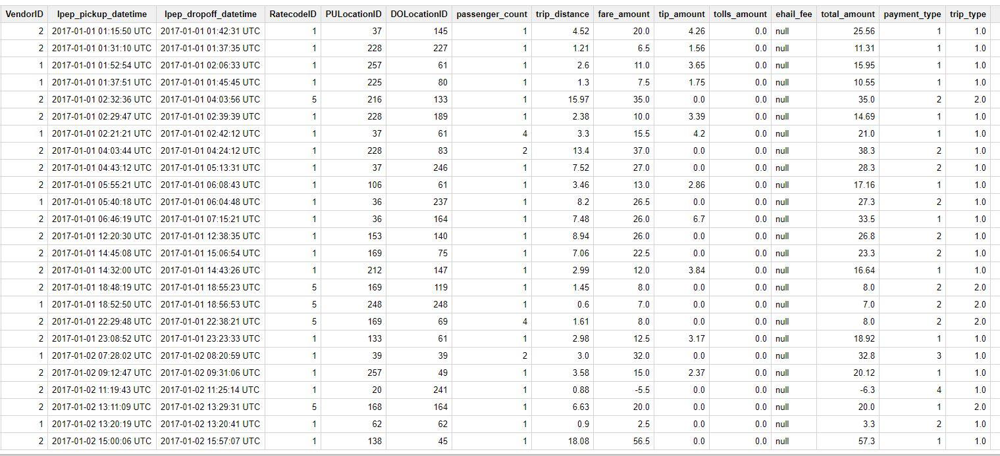

# New York City Taxi and Limousine Commission (TLC) Trip Record Data Analysis

## Motivation
<p>You’ll know which city I am talking about if I start describing it as the most populous city in the States, one of the biggest and the best places to be, the Big Apple, The City that never sleeps (literally). You got it right! Its NYC! I am very sure, that out of the many things that pop in your mind when you think of New York, the yellow taxicab:taxi: definitely has been in the list. New York is the home of this iconic yellow cab and can be commonly identified as a symbol of the city. The history of these cabs licensed under New York City Taxi and Limousine Commission (TLC) goes way back to the 70’s [(1)](https://en.wikipedia.org/wiki/Taxicabs_of_New_York_City). These cabs can be hailed from the streets anywhere and serve as a means of commute for thousands of New Yorkers on a daily basis. Where technology has advanced to an extent that almost everything is just a click away, this cab system has functioned in a conventional non-tech manner, until the recent launch of an app. This spiked my interest to take a look into the backend of this system. Being a techie, I could not resist the temptation of uncovering what lies beneath the humungous heap of data that must have accumulated over all these years. Like, what modes of payment were the largely preferred by the customers, how generously would they tip their cabbies, what were the vendor preferences, [(2)](https://www.marketwatch.com/story/this-chart-shows-how-uber-rides-sped-past-nyc-yellow-cabs-in-just-six-years-2019-08-09) why are people preferring Lyft and Uber when a taxicab system was already in place? I have managed to acquire a small data set of the past few years which will help me gain deep meaningful insights about this popular system. Since, such a large valuable amount of data is offered in a very basic format, its essential that it be processed meticulously and represented in a way which is easiest to understand and pleases the eye.</p>


## About the Data
During the search for data set I found that Amazon have open dataset on AWS. When data is shared on AWS, anyone can analyze it and build service on top of it using a broad range of compute and data analytics product. This helps me a lot as it allows me to spend more time on data analysis rather than data acquisition. The [Registry of Open Data](https://registry.opendata.aws/) on AWS makes help me to find the dataset which are made publicly available through AWS services. [New York City Taxi and Limousine Commission (TLC) Trip Record Data](https://registry.opendata.aws/nyc-tlc-trip-records-pds/) is one of those open datasets on AWS which I choose for this project. Below are few details about this dataset:
### Description
  - This [data set](https://www1.nyc.gov/site/tlc/about/tlc-trip-record-data.page) consist of data of trips taken by taxis and for-hire vehicles in New York City.
  - It consist of [TLC trip record](https://www1.nyc.gov/assets/tlc/downloads/pdf/trip_record_user_guide.pdf) related to Yellow, Green and For-Hire vehicles trip data from year 2009-2019. The yellow and green taxi trip records include fields capturing pick-up and drop-off dates/times, pick-up and drop-off locations, trip distances, itemized fares, rate types, payment types, and driver-reported passenger counts.
  - In this project I am going to analyze the 3 years data (2017-2019) and the size of dataset is 53.51 GB.
  - This data set have NYC TLC trip data in form of CSV file, for each year it has 12 CSV files (per month one file) for each type of taxis services
  - Below is the structure of taxis services trip records:
  
      1. [Yellow Taxis](https://www1.nyc.gov/assets/tlc/downloads/pdf/data_dictionary_trip_records_yellow.pdf)
      
      2. [Green Taxis](https://www1.nyc.gov/assets/tlc/downloads/pdf/data_dictionary_trip_records_green.pdf)
      
  - Each of the CSV file for every taxi will have a comma separated data as shown below:
  ```markdown
For example: VTS,2009-01-04 02:52:00, 2009-01-04 03:02:00, 1, 2.6299999999999999, -73.991956999999999, 40.721567, -73.993803, 40.695922000000003, CASH, 8.9000000000000004, 0.5, , 0, 0, 9.4000000000000004
```

## Obtaining the Data & Preprocessing
- Step 1: Files Downloading and storing to on local disk
To download the CSV file I wrote the below Python script. In this script I am giving all the URLs in the form of array as an input to download_csv function and with the help of requests library I am downloading the csv file and write it to destination folder.

```markdown

import requests
from time import time
urls = ["https://nyc-tlc.s3.amazonaws.com/trip+data/fhv_tripdata_2019-01.csv",
        "https://nyc-tlc.s3.amazonaws.com/trip+data/fhv_tripdata_2019-02.csv",
        "https://nyc-tlc.s3.amazonaws.com/trip+data/fhv_tripdata_2019-03.csv",
        "https://nyc-tlc.s3.amazonaws.com/trip+data/fhv_tripdata_2019-04.csv",
        "https://nyc-tlc.s3.amazonaws.com/trip+data/fhv_tripdata_2019-05.csv",
        "https://nyc-tlc.s3.amazonaws.com/trip+data/fhv_tripdata_2019-06.csv",
        "https://nyc-tlc.s3.amazonaws.com/trip+data/fhv_tripdata_2019-07.csv",
        "https://nyc-tlc.s3.amazonaws.com/trip+data/fhv_tripdata_2019-08.csv",
        "https://nyc-tlc.s3.amazonaws.com/trip+data/fhv_tripdata_2019-09.csv",
        "https://nyc-tlc.s3.amazonaws.com/trip+data/fhv_tripdata_2019-10.csv",
        "https://nyc-tlc.s3.amazonaws.com/trip+data/fhv_tripdata_2019-11.csv",
        "https://nyc-tlc.s3.amazonaws.com/trip+data/fhv_tripdata_2019-12.csv", ] 
  
 def download_csv(url):
    path = 'C:/Nilay/a.csv'
    print(url)
    r = requests.get(url, stream=True)
    with open(path, 'wb') as f:
        for ch in r:
            f.write(ch)
start = time()
for x in urls:
    download_csv(x)
    print(f"Time to download: {time() - start}")
code ref: https://likegeeks.com/downloading-files-using-python/

```

- Step 2: Data filtering
Every file was approximately size of 2 GB, so used the below Python script to drop some of its column before uploading it to Google cloud storage. It reduces uploading time consumption.

```markdown
import os
import pandas as pd
col_to_put = ['VendorID', 'tpep_pickup_datetime',
               'tpep_dropoff_datetime', 'passenger_count', 
               'trip_distance', 'RatecodeID', 'PULocationID',
               'DOLocationID', 'payment_type', 'fare_amount',
               'tip_amount', 'tolls_amount', 'total_amount'] 
add_header = True
chunksize = 10 ** 5
my_path = "C:/Nilay/Data Processing in Cloud/Personal Project DataSet/2019"

for r, d, f in os.walk(my_path):
    for curr_file in f:
      print(curr_file)
      fileName = "C:/Nilay/Data Processing in Cloud/Personal Project DataSet/2019/"
      for chunk in pd.read_csv(fileName + curr_file, chunksize=chunksize,usecols=col_to_put):
          chunk.to_csv("C:/Nilay/Data Processing in Cloud/" + curr_file, mode='a', index=False, header=add_header) 
          if add_header:
              # The header should not be printed more than one
              add_header = False
```

- Step 3: Data Storing
All the csv file of size 53.51 GB are stored on the google cloud storage with help of google command line instruction as given below:
```markdown
gsutil -o GSUtil:parallel_composite_upload_threshold=150M -m cp -r FOLDERNAME/FILENAME gs://BUCKET_PATH
```
You can find more details regarding file uploading on google storage through command [here](https://cloud.google.com/storage/docs/gsutil/commands/cp#synopsis).

- Step 4: Loading data to Big Query
With help of Big Query “[Loading data from cloud storage](https://cloud.google.com/bigquery/docs/loading-data-cloud-storage#overview)” feature I have created the table in Big Query with auto schema detection option. More information under the next title.

## BigQuery
  - How to load data to Big Query?
    There are different ways to load the data on Big Query, one can load the data:
      1. From [Cloud Storage](https://cloud.google.com/bigquery/docs/loading-data-cloud-storage#overview)
      2. From [Local Storage](https://cloud.google.com/bigquery/docs/loading-data-local#overview)
      3. [And many more](https://cloud.google.com/bigquery/docs/loading-data-local#overview)
    There is a limitation on loading data using the classic Big Query web UI, files loaded from a local data source must be 10 MB or less and must contain fewer than 16,000 rows. If this is the case one can load the data with help of Cloud storage and in this project each file is of size 1.5 GB so I have upload all the file to cloud storage and then loading it to Big Query.
  - How to [load data to Big Query](https://cloud.google.com/bigquery/docs/loading-data#overview) from cloud storage with Classic UI?
      - As describe in 3-step3 you can upload the files to cloud storage. And then re-direct to Big Query [web UI console](https://bigquery.cloud.google.com/welcome), in the navigation panel you can click on “create new table” and create the table page will open. In the create table section you can select the location from where you want to upload the file(for this project I am using google cloud storage) and then select the format of the file(CSV for this project).
      - After selecting the file location, it will ask you for [schema selection](https://cloud.google.com/bigquery/docs/loading-data-local#loading_data_from_a_local_data_source), you can select the “Automatically detect” option this will detect the schema on basis of first row column name of you CSV file. Otherwise you can define the schema on your own also.
      - After defining schema, you have option to [appending to or overwriting](https://cloud.google.com/bigquery/docs/loading-data-local#appending_to_or_overwriting_a_table_using_a_local_file) a table using a local file. If the schema of the data does not match the schema of the destination table or partition, you can update the schema when you append to it or overwrite it.
  - How the schema for the table and it contains look after loading data?
        - In this project I have created the table for Green, Yellow, FHV taxis in Big Query as below:
        - 
        ```markdown
            1. **Yellow Taxis Table schema and content preview:**
                    
                    
            2. **Green Taxis Table schema and content preview:**
                    
                    
         ```

## Analytics


            
## Welcome to GitHub Pages

You can use the [editor on GitHub](https://github.com/nilaynarlawar/New-York-City-Taxi-and-Limousine-Commission-TLC-Trip-Record-Data-Analysis/edit/master/index.md) to maintain and preview the content for your website in Markdown files.

Whenever you commit to this repository, GitHub Pages will run [Jekyll](https://jekyllrb.com/) to rebuild the pages in your site, from the content in your Markdown files.

### Markdown

Markdown is a lightweight and easy-to-use syntax for styling your writing. It includes conventions for

```markdown
Syntax highlighted code block

# Header 1
## Header 2
### Header 3

- Bulleted
- List

1. Numbered
2. List

**Bold** and _Italic_ and `Code` text

[Link](url) and 
```

For more details see [GitHub Flavored Markdown](https://guides.github.com/features/mastering-markdown/).

### Jekyll Themes

Your Pages site will use the layout and styles from the Jekyll theme you have selected in your [repository settings](https://github.com/nilaynarlawar/New-York-City-Taxi-and-Limousine-Commission-TLC-Trip-Record-Data-Analysis/settings). The name of this theme is saved in the Jekyll `_config.yml` configuration file.

### Support or Contact

Having trouble with Pages? Check out our [documentation](https://help.github.com/categories/github-pages-basics/) or [contact support](https://github.com/contact) and we’ll help you sort it out.
